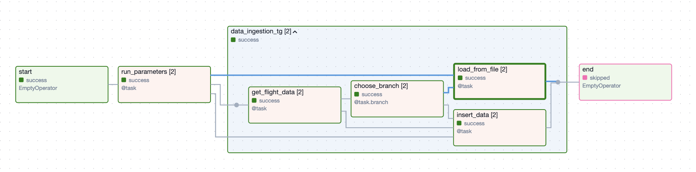

# Pipeline de Données Airflow – OpenSky Network
___

**Pipeline De Données Construite**



**Objectif du projet**

Ce projet a pour objectif de concevoir et orchestrer un pipeline de données avec Apache Airflow permettant de :

Récupérer automatiquement les données States et Flights depuis l’API OpenSky Network

Traiter et stocker ces données dans une base DuckDB

Illustrer les concepts avancés d’Airflow à travers un DAG dynamique et modulaire

Utiliser Docker pour assurer la portabilité et la reproductibilité de l’environnement

Ce projet s’inscrit dans une démarche pédagogique visant à maîtriser la planification, l’automatisation et la supervision de workflows de données.

## Concepts Airflow abordés

Ce pipeline met en œuvre les fonctionnalités clés suivantes :

- DAG dynamique

- TaskFlow API

- Dynamic Task Mapping

- XComs pour le partage de données entre tâches

- Variables Airflow et templates Jinja

- TaskGroup pour structurer le DAG

- BranchPythonOperator pour gérer des chemins conditionnels

- Planification (schedule) du DAG

- Gestion des dépendances

- Exécution dans Docker

## Architecture du pipeline

```powershell 

OpenSky API
   │
   ├── States Data
   ├── Flights Data
   │
Apache Airflow (DAG dynamique)
   │
   ├── Extraction
   ├── Validation
   ├── Transformation
   └── Chargement
        ↓
     DuckDB
```

